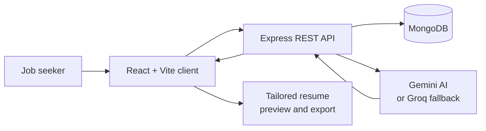

# GenForge — AI Resume Studio

> Build a polished, truthful, job-ready resume with AI assistance.

GenForge is an end-to-end generative AI resume application built for the **GenForge – Generative AI Mini Challenge**. It helps job seekers turn their real work history, education, skills, and achievements into a professional resume that can be tailored for a specific job description.

Unlike tools that invent impressive-sounding claims, GenForge keeps the user in control. Its AI is instructed to improve wording, identify relevant existing experience, and point out genuine gaps—never to make up skills, job titles, achievements, or numbers.

## Submission links

| Item | Link |
| --- | --- |
| Live demo | Add your public deployed-app URL here |
| Demo video | Add your public video URL here |
| Source code | https://github.com/yasmeen-taj111/GENFORGE |

> Before submitting, replace the three placeholders above with your real public links and confirm that they open in an incognito browser window.

## The problem

Writing a resume is difficult, and tailoring it for every job is even harder. Candidates often spend hours comparing their resume with a job description, finding missing keywords, rewriting bullet points, and checking whether the document is complete. Generic AI tools can make this worse by adding claims that are not true.

## Our solution

GenForge combines a structured resume builder with generative AI. A user creates or uploads a resume, adds a target job description, and receives clear suggestions that are based only on information already present in their profile. They can review every suggestion before applying it, see an ATS-style match score, choose a template, and export the final document.

## Key features

- **Resume builder:** Create, edit, duplicate, and manage multiple targeted resumes. Save the best tailoring plan as a separate ATS-optimized copy while keeping the original resume unchanged.
- **Master profile:** Maintain reusable work experience, projects, skills, education, certifications, and achievements in one place.
- **Resume import:** Upload an existing PDF or DOCX resume (up to 10 MB) and convert its text into editable resume sections.
- **AI writing assistant:** Improve summaries, project descriptions, and experience bullets for clarity, conciseness, impact, or ATS-friendly wording.
- **Job description intelligence:** Extract job requirements, skills, technologies, responsibilities, and important keywords from a pasted job description.
- **Truthful AI tailoring:** Produce three reviewable tailoring options—ATS-focused, balanced, and light edit—then select the highest-scoring truthful option. Job-relevant skills can be added only after the user confirms they have learned or used them.
- **ATS-style analysis:** Compare a resume against a job description and show a transparent 0–100 score with keyword, skills, relevance, completeness, and formatting checks.
- **AI copilot and recruiter review:** Ask context-aware resume questions and receive strengths, weaknesses, and practical recommendations.
- **Live preview and templates:** Preview changes instantly in Minimal, Modern, Professional, Executive, Technical, Academic, or ATS-safe layouts. Users can also adjust typography, spacing, margins, and accent color.
- **Export options:** Download the completed resume as PDF, HTML, or LaTeX.

## How it works



1. The user registers, creates a resume, or uploads an existing PDF/DOCX.
2. The user enters a target role and pastes a job description.
3. GenForge analyzes the job description and matches it to the user’s real resume content.
4. Generative AI suggests clearer and more relevant wording without adding unsupported claims.
5. The user chooses which suggestions to apply, reviews the updated ATS-style score, then exports the final resume.

## Generative AI integration

GenForge uses **Groq** as the primary AI provider and supports **Google Gemini** as a configurable fallback provider. The provider is selected through environment variables, so the app can continue working if the chosen service is unavailable and a fallback key has been configured.

AI is used for:

- Rewriting a professional summary while preserving facts.
- Improving experience and project bullet points with stronger, clearer language.
- Structuring information extracted from a job description.
- Suggesting truthful ways to tailor a resume to a job description.
- Providing a recruiter-style review and answering copilot questions using the active resume context.
- Organizing text extracted from uploaded resume files into editable fields.

### Responsible AI guardrails

The AI prompts explicitly prohibit fabricated metrics, experience, skills, technologies, job titles, and achievements. Tailoring suggestions are shown before they are applied. If a job requirement is not supported by the resume, GenForge presents it as a gap for the user to address honestly.

If the AI provider is temporarily unavailable, job-description analysis and tailoring return a limited local fallback result so the user can continue working. Features that need a full AI response will ask the user to retry.

## Architecture and design decisions

| Area | Choice | Why it was chosen |
| --- | --- | --- |
| Client | React, Vite, Zustand, Tailwind CSS | Fast interactive editing, immediate preview updates, and simple state management. |
| Server | Node.js and Express | A lightweight REST API for authentication, resume data, files, ATS analysis, and AI calls. |
| Data | MongoDB with Mongoose | Flexible document structures fit resumes, profiles, and changing sections well. |
| Security | JWT authentication and bcrypt password hashing | Keeps each user’s resumes and profile protected. |
| AI layer | Groq primary with Gemini fallback | Provides reliable generative AI access without tying the app to one provider. |
| File parsing | Multer, pdf-parse, and Mammoth | Supports importing common resume formats: PDF and DOCX. |

The ATS-style score is deliberately transparent and deterministic. It evaluates normalized resume content against the pasted job description using these weighted checks:

| Check | Weight |
| --- | ---: |
| Keyword match | 30 |
| Skills coverage | 20 |
| Job-description requirement relevance | 20 |
| Experience relevance | 15 |
| Section completeness | 10 |
| Basic formatting checks | 5 |
| **Total** | **100** |

This score is a guide for improving clarity and relevance; it does not guarantee a recruiter or third-party ATS outcome.

## Tech stack

- **Frontend:** React 19, Vite, Zustand, Tailwind CSS, Axios, Lucide React
- **Backend:** Node.js, Express, JWT, bcryptjs, Multer
- **Database:** MongoDB and Mongoose
- **AI:** Groq API with optional Google Gemini fallback
- **Document tools:** pdf-parse, Mammoth, jsPDF, html2canvas

## Run locally

### Prerequisites

- Node.js 18 or later
- MongoDB running locally, or a MongoDB Atlas connection string
- A Gemini API key and/or a Groq API key for full AI features

### 1. Configure the server

```bash
cd server
npm install
cp .env.example .env
```

Edit `server/.env` and provide your own values:

```env
PORT=5001
MONGODB_URI=mongodb://127.0.0.1:27017/genforge
JWT_SECRET=replace_with_a_long_random_secret
GEMINI_API_KEY=your_gemini_api_key
GROQ_API_KEY=your_groq_api_key
AI_PROVIDER=gemini
GEMINI_MODEL=gemini-1.5-flash
GROQ_MODEL=llama-3.3-70b-versatile
CLIENT_URL=http://localhost:5173
```

Start the API server:

```bash
npm run dev
```

The server runs at `http://localhost:5001`.

Optional: create the demo account (`demo@genforge.com` / `password123`) and sample data:

```bash
npm run seed
```

### 2. Start the client

Open a second terminal:

```bash
cd client
npm install
npm run dev
```

Open `http://localhost:5173` in your browser.

### Production client configuration

The frontend reads `VITE_API_BASE_URL`. For a separately hosted API, add a `client/.env` file locally, for example:

```env
VITE_API_BASE_URL=https://your-api.example.com/api
```

Do not put secret API keys in any `VITE_` variable: those values are included in the browser build.

## API overview

All protected routes require a JWT bearer token.

| Area | Base route | Purpose |
| --- | --- | --- |
| Authentication | `/api/auth` | Register, log in, and verify the signed-in user. |
| Profiles | `/api/profile` | Read and update the master profile. |
| Resumes | `/api/resumes` | Create, update, duplicate, delete, import, and retrieve resumes. |
| AI | `/api/ai` | Rewrite content, analyze job descriptions, tailor resumes, review, and copilot chat. |
| ATS | `/api/ats` | Analyze or preview resume-to-job-description matching. |

## Project structure

```text
GENFORGE/
├── client/                 # React + Vite user interface
│   └── src/
│       ├── components/     # Builder tools, templates, ATS analyzer, copilot
│       ├── pages/          # Login, dashboard, profile, builder, JD analysis
│       └── store/          # Authentication and resume application state
├── server/                 # Express API
│   └── src/
│       ├── controllers/    # Request handling and AI fallback behavior
│       ├── models/         # MongoDB schemas
│       ├── routes/         # REST endpoints
│       └── services/ai/    # Gemini and Groq provider layer
├── .gitignore
└── README.md
```

---
